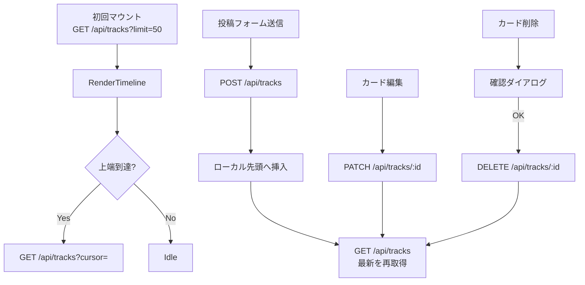
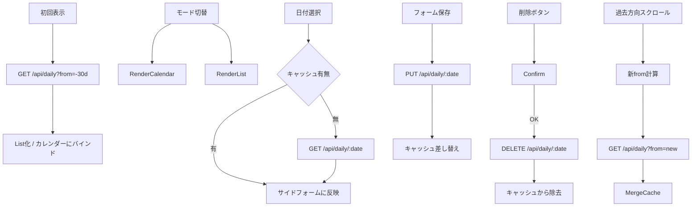
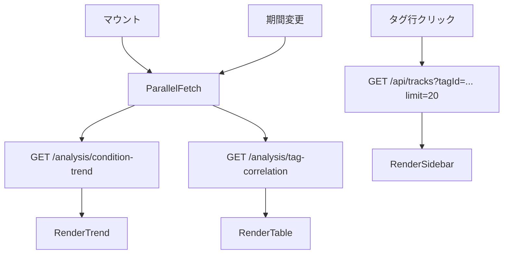
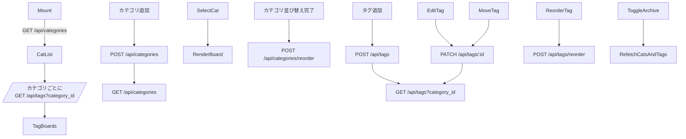

# View

## 全体構成
- 上部に固定ヘッダー（ロゴ / 現在日付 / グローバルナビ）。ナビは `Track`・`Daily`・`Analysis`・`Tag` の4タブ。
- 主要画面は 1 カラムレイアウト（幅 960px 目安）を基本とし、必要に応じてサイドパネルを追加する。
- API は `docs/specification/api.md` に準拠し、取得系は `SWR`/`React Query` 相当のフェッチャーでキャッシュ・リフェッチを制御する。
- エラー時はトーストで概要を出しつつ、コンポーネント内に再試行ボタン付きのアラートを配置する。
- ローディングは骨組み（Skeleton）を使用し、ユーザー操作を極力阻害しない。

## 共通インタラクション
- `condition` 入力は -2〜2 のラジオ型スライダーに統一。ラベルは `-2 とても悪い` 〜 `+2 とても良い`。
- `tagIds` 選択はカテゴリごとのトグルタグチップ（複数選択可）を使用。カテゴリアコーディオンで折り畳み。
- 削除系操作（Track削除、Daily削除、Tagアーカイブ解除など）は確認ダイアログを経由。
- 日付/期間指定コンポーネントは日付ピッカーとプリセット（7日/30日/90日）を用意し、分析・日記で共通利用する。

## Track 画面

### 画面目的
- 日々の出来事（トラック）を時系列に閲覧・追加・編集・削除する。
- タグによる分類結果を即座に確認できるようにする。

### データフロー
- 初回ロード: `GET /api/tracks?limit=50`。レスポンスの `items` を新しい順で描画。
- 追加読み込み: リスト上端到達時に `cursor` = 表示中最古 `createdAt` を付与して再取得。`nextCursor` が null でロード終了。
- 新規投稿: `POST /api/tracks`。成功後はリスト先頭に楽観的挿入し、`GET /api/tracks` をリフェッチ。
- 編集: `PATCH /api/tracks/:id`。モーダルフォームで実行。タグ無効IDはAPI側で除外されるが、UI側でも未存在タグを選択肢から除外。
- 削除: `DELETE /api/tracks/:id`。成功後はローカルから除去しリフェッチ。

### UI構造
- 上部に固定投稿フォーム（メモ入力欄、コンディションスライダー、タグ選択、送信ボタン）。
- 投稿フォーム右側に「最近使用したタグ」ショートカット（直近5件）を表示。
- 投稿リストは「タイムラインカード」を縦並び。各カードは以下を表示:
  - タイムスタンプ（`createdAt` をユーザータイムゾーン換算で表示、ホバーでUTC表示）
  - コンディションバッジ（色分け: -2赤〜+2青の5段階）
  - メモ（Markdown簡易対応：リンク化と改行のみ）
  - タグチップ群
  - 操作用アイコン（編集 / 削除 / タグ管理画面へのショートカット）
- 先頭に「新着未読バー」を表示し、他タブで作成された新規トラックがあれば `GET /api/tracks?cursor=<最新>` で差分取得。

### フィルタと補助
- タグフィルタ: カテゴリ別ドロップダウン + タグマルチセレクト。選択時はクエリパラメータを `tagId` array にして `GET /api/tracks` を再取得（API拡張前提で `tagId` が複数指定可能なフィルタを実装）。
- コンディションフィルタ: -2〜+2 のチェックボックス群。フィルタ非対応のAPIへの影響を避けるため、フロント側でクライアントフィルタリング。
- 検索: メモ全文検索はクライアント側。計算量抑制のため、取得済みデータ内に限定。

### 状態遷移
- ローディング: 一覧・追加読み込みとも Skeleton を3枚表示。
- エラー: `400`/`404`/`500` などは共通エラーパネル。「再読み込み」「詳細をコピー」ボタンを併設。
- 空状態: 初回取得 `items.length === 0` の場合、「まだトラックがありません。最初の記録を追加しましょう」という案内とショートカットボタンを表示。

## Daily 画面

### 画面目的
- 日記とコンディションを日次単位で管理する。
- カレンダーでコンディション推移を俯瞰しつつ、詳細はリスト形式で閲覧・編集する。

### データフロー
- 初回ロード: `GET /api/daily?to=<今日の日付>&from=<30日前>` で一覧取得。
- カレンダーカードで日付を選択した際は `GET /api/daily/:date` で詳細をリフェッチ（既に一覧に含まれる場合はキャッシュを利用）。
- 編集・作成は日付フォーム（右サイドパネル）。`PUT /api/daily/:date` を送信、成功後に対象日レコードだけを差し替え。
- 削除: `DELETE /api/daily/:date`。削除後に該当日を空状態へ。
- 無限スクロール: 過去方向へスクロールすると `from` をさらに30日ずつ拡張して再取得し、既存データとマージ。

### UI構造
- 画面上部にモード切替トグル `カレンダー / リスト`。
- **カレンダーモード**
  - 月表示のグリッド。各セルにコンディションを色（-2=濃赤〜+2=濃青）で可視化。
  - セル下部にタグの主要2件までアイコン表示（タグ情報は最新トラックとのひも付けではなく、Dailyにはタグがないため、直近トラックハイライトは表示しない）。
  - セルを押下すると右側に詳細パネルをスライド表示し、メモを編集可能。
- **リストモード**
  - 日付降順でカード表示。各カードは日付ヘッダー、コンディションバッジ、メモ本文、操作（編集/削除）。
  - 過去スクロールでローディングバー表示。
- 右サイドパネルは常に当日の日記フォームを表示し、モード切替によらず利用できる。

### バリデーションと補助
- コンディション必須。未入力での送信はエラー表示。
- メモ入力はプレーンテキスト（5000文字制限を超えると残り文字数の警告）。
- 既存日記がない日を選択した場合は空のフォームを表示し、「作成」文言に切り替え。

### 状態遷移
- データなし: 「この期間には日記がありません」と表示し、期間プリセットを提示。
- APIエラー: Track と同様の共通エラーパネル。

## Analysis 画面

### 画面目的
- Track/Daily の統計情報を視覚的に把握し、コンディションの傾向やタグとの関連を洞察する。

### データフロー
- 初回ロード: デフォルト期間は直近30日。`GET /api/analysis/condition-trend` と `GET /api/analysis/tag-correlation` を並列取得。
- 期間変更時は両 API を再フェッチ。期間が長くデータ量が多い場合はローディングステートを分割し、個別にスケルトン表示。

### UI構造
- 画面上部に期間ピッカー（プリセット: 7日 / 30日 / 90日 / カスタム）。
- **コンディション推移カード**
  - 折れ線グラフ（X 軸: 日付、Y 軸: コンディション値）。データポイントにホバーで日付と値表示。
  - 連続欠損日は破線で表示。値が存在しない日（daily未記録）は0扱いではなく欠損として描画。
- **タグ相関カード**
  - テーブル + バーチャート。列: タグ名、使用回数、平均コンディション。
  - テーブルヘッダーでソート（使用回数降順/平均値昇順など）。
  - 平均コンディションはカラーバッジで可視化（悪い:赤系、良い:青系）。
  - `usageCount` が0でも集計対象に含まれる場合は0件表示。
- **深掘りサイドバー**
  - 任意タグを選択すると、直近の Track を `GET /api/tracks?limit=20&tagId=<id>` で取得してサイドバー表示（APIにタグフィルタを追加実装する場合）。暫定としてフロント側フィルタリングでも対応可能。

### 状態遷移
- データなし: 「指定期間にデータがありません」と表示し、期間を広げる提案。
- エラー時はカード単位でエラーパネル、他カードへの影響を最小化。

## Tag 画面

### 画面目的
- カテゴリ/タグの整理、表示順制御、アーカイブ管理を行う。

### データフロー
- 初回ロード: `GET /api/categories`（未アーカイブのみ）を取得後、各カテゴリに対して `GET /api/tags?category_id=<id>` を並列取得。
- アーカイブ表示切替がオンの場合は `include_archived=true` を付与。
- カテゴリ追加: `POST /api/categories`。成功後にカテゴリ一覧再取得。
- カテゴリ編集: `PATCH /api/categories/:id`。名称・色・アーカイブを編集。
- カテゴリ並び替え: ドラッグ操作確定時に `POST /api/categories/reorder`。フロントでは 0 始まり連番を計算して渡す。
- タグ追加: 選択中カテゴリに対して `POST /api/tags`。
- タグ編集: `PATCH /api/tags/:id`。カテゴリ間移動もサポートし、移動先/元カテゴリのタグ一覧をリフェッチ。
- タグ並び替え: カテゴリ内ドラッグ＆ドロップ → `POST /api/tags/reorder` に `categoryId` と `sortOrder` を渡す。

### UI構造
- 左カラム: カテゴリリスト（カラーサンプルと名称、件数バッジ、並び替えハンドル）。
  - ヘッダーに「＋カテゴリ追加」ボタン。
  - アーカイブ表示トグルとフィルタ（名称検索）。
- 右カラム: 選択カテゴリのタグボード。
  - タグカードは名称・使用頻度（Track 集計結果を表示する場合は Analysis と共有の集計を再利用）を表示。
  - 行末アイコンで編集 / アーカイブ / 並び替えハンドル。
  - アーカイブ済みタグは半透明表示、解除ボタンを表示。
- 並び替え操作中は「保存」ボタンを表示し、確定時に API 送信。送信完了まではプログレスバー。

### 状態遷移
- カテゴリなし: 空表示カードと「最初のカテゴリを作成」案内。
- タグなし: 「タグが登録されていません」テキストと追加ボタン。
- エラー: 共通エラーパネルをカテゴリ列・タグ列それぞれに表示し、部分的にリトライ可能。

## クロスリンク
- Track カードのタグチップをクリック → Tag 画面に遷移し該当タグをハイライト。
- Daily カードの編集完了時に、同日に紐づく Track をサイドバーに表示（`GET /api/tracks?limit=20&cursor=<date_end>&tagId?` を利用、日付フィルタはフロント側で日付範囲絞込）。
- Analysis のタグ相関テーブルでタグ名をクリックすると Tag 画面へ、または Track サイドバーを開く。

## 非機能要件（画面側）
- フォーム送信時は多重送信防止のためボタンをローディング状態にする。
- API リフェッチは visibilitychange や週次訪問時に自動実行し、データ鮮度を保つ。
- PC/タブレット優先だが、モバイルではタブバーを下部固定に変更し、サイドパネルは全画面モーダルへ切り替える。
- アクセシビリティ: タブとフォーム要素には `aria-*` 属性を適切に付与し、キーボード操作で全操作が完結するようにする。

## プロトタイプ（ワイヤーフレーム）

### 共通レイアウト
```
+--------------------------------------------------------------+
| Header: ロゴ | 今日(2025-10-09) | Tabs[Track][Daily][Analysis][Tag] |
+--------------------------------------------------------------+
| Toast Stack (右上)                                           |
+--------------------------------------------------------------+
| Main Container (max-width: 960px, 中央寄せ)                  |
|   ├─ Contextual Panel / Sidebar (必要時のみ表示)             |
|   └─ Primary Column                                          |
+--------------------------------------------------------------+
| Footer Utility (ショートカット、フィードバックリンク)        |
+--------------------------------------------------------------+
```

### Track 画面ワイヤーフレーム
```
+--------------------------------------------------------------+
| Header                                                       |
+--------------------------------------------------------------+
| 新着バー (未読n件, リロードボタン) ↑方向スクロールで非表示      |
+--------------------------------------------------------------+
| 投稿フォーム                                                 |
|   Memo Textarea (auto-grow)                                  |
|   Condition Slider [-2 -1 0 +1 +2]                           |
|   タグアコーディオン:                                        |
|       [カテゴリA] [Tag Chip][Tag Chip]                       |
|       [カテゴリB] [Tag Chip]                                 |
|   最近使ったタグ (チップ5件)                                 |
|   送信ボタン / キャンセル                                   |
+--------------------------------------------------------------+
| タイムラインスクロール領域（上方向が過去）                   |
|   ├─ TrackCard                                               |
|   |    Header: 12:34 / 更新 12:40 / Condition +1             |
|   |    Body: Memo (markdown簡易レンダリング)                |
|   |    Tags: [頭痛][服薬]                                    |
|   |    Actions: 編集 / 削除 / Tag管理へ                      |
|   ├─ TrackCard ...                                           |
|   └─ Loading Skeleton (3枚)                                  |
+--------------------------------------------------------------+
| Infinite Loader (IntersectionObserver)                       |
+--------------------------------------------------------------+
```

#### Track 画面フロープロトタイプ


### Daily 画面ワイヤーフレーム
```
+--------------------------------------------------------------+
| Header                                                       |
+--------------------------------------------------------------+
| モードトグル [カレンダー][リスト] | 期間ピッカー              |
+--------------------------------------------------------------+
| レイアウト: 左=メイン, 右=サイドフォーム                     |
| 左側                                                          
|   ├─ カレンダービュー (月グリッド, セル色=condition)         |
|   └─ リストビュー (active時のみ高さ0→表示)                  |
|        [日付ヘッダー][Conditionバッジ][メモ抜粋]             |
|        [編集][削除]                                          |
| 右側                                                          
|   └─ 日付フォーム (選択日 / 当日)                            |
|        Condition Slider, Memo Textarea, 保存ボタン           |
+--------------------------------------------------------------+
| 下部: 過去読み込みボタン / 無限スクロールローダー            |
+--------------------------------------------------------------+
```

#### Daily 画面フロープロトタイプ


### Analysis 画面ワイヤーフレーム
```
+--------------------------------------------------------------+
| Header                                                       |
+--------------------------------------------------------------+
| 期間ピッカー [7d][30d][90d][Custom]                          |
+--------------------------------------------------------------+
| KPIカード群 (任意: 最高/最低コンディションなど)             |
+--------------------------------------------------------------+
| 折れ線グラフカード (Condition Trend)                         |
|   Y軸: -2〜+2, X軸: 日付                                     |
|   Hover Tooltip                                              |
| テーブル + バーチャートカード (Tag Correlation)             |
|   列: Tag / Usage / Avg condition                            |
|   ソートドロップダウン                                       |
+--------------------------------------------------------------+
| サイドバー (タグ選択→直近Track)                              |
+--------------------------------------------------------------+
```

#### Analysis 画面フロープロトタイプ


### Tag 画面ワイヤーフレーム
```
+--------------------------------------------------------------+
| Header                                                       |
+--------------------------------------------------------------+
| レイアウト: 左=カテゴリ列 / 右=タグボード                    |
+--------------------------------------------------------------+
| 左カラム                                                     |
|   [カテゴリ検索][アーカイブ表示トグル]                       |
|   + カテゴリ追加ボタン                                       |
|   ├─ カテゴリカード:                                         |
|   |    カラーサンプル + 名称 + 件数 + 並び替えハンドル      |
|   |    クリックで選択状態                                    |
|   └─ ...                                                     |
+--------------------------------------------------------------+
| 右カラム                                                     |
|   Header: 選択カテゴリ名 + 並び替え保存ボタン                |
|   + タグ追加ボタン                                           |
|   ├─ タグカード: 名称 / 使われた回数 / 操作 (編集/アーカイブ) |
|   ├─ ...                                                     |
|   └─ アーカイブ済みは半透明 + 解除ボタン                     |
+--------------------------------------------------------------+
| 並び替え中表示: 固定ボトムバーに「並び替え中」「保存/取り消し」|
+--------------------------------------------------------------+
```

#### Tag 画面フロープロトタイプ


### モバイル時レイアウトメモ
```
+-------------------+    +-------------------+
| Header            |    | Bottom Tab Bar    |
|  (ハンバーガー)   |    | [Track][Daily][Analysis][Tag] |
+-------------------+    +-------------------+
| 各画面とも1カラム |    | サイドパネル→全画面モーダル |
+-------------------+    +-------------------+
```
